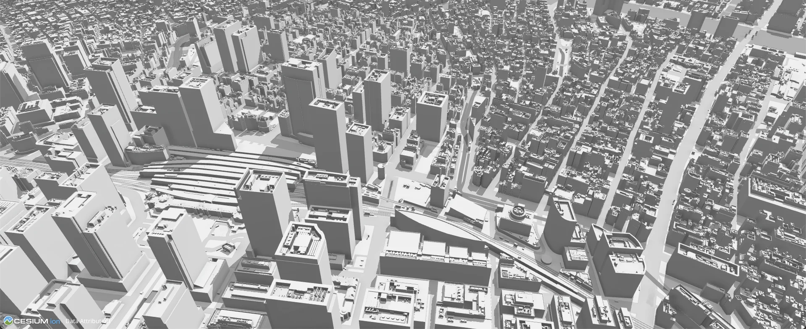

# PLATEAU VIEW 5.0

PLATEAU VIEW 5.0 は以下のシステムにより構成されます。

- **PLATEAU CMS**: ビューワーに掲載する各種データの管理・配信を行う。
- **PLATEAU Editor**: ビューワーの作成・公開を行う Web アプリケーション。
- **PLATEAU Flow**: PLATEAU のデータ変換や品質検査のワークフローを構築・実行する Web アプリケーション。
- **PLATEAU VIEW**: PLATEAU をはじめとする様々なデータセットの可視化が可能な Web アプリケーション。

システムの詳細な仕様は、[PLATEAU VIEW 構築マニュアル](https://www.mlit.go.jp/plateau/file/libraries/doc/plateau_doc_0009_ver05.pdf)を、PLATEAU 配信サービスや API の詳細については、[PLATEAU 配信サービスドキュメント](https://docs.plateauview.mlit.go.jp/)（[ソース](docs)）を参照してください。

## フォルダ構成

- [cloudflare](cloudflare): Cloudflare Workers
- [cms](cms): PLATEAU CMS
- [docs](docs): PLATEAU 配信サービスの公式ドキュメントサイト（Astro + Starlight 製、`docs.plateauview.mlit.go.jp` で公開）
- [e2e](e2e): PlaywrightによるPLATEAU VIEWの自動E2Eテスト用パッケージ
- [editor](editor): PLATEAU Editor
- [extension](extension): PLATEAU Editor の拡張機能
- [flow](flow): PLATEAU Flow
- [geo](geo): PLATEAU VIEW の一部機能（住所検索など）を動作させるためのサーバーアプリケーション
- [server](server): CMS と共に動作し PLATEAU の API を提供するサーバーアプリケーション（サイドカーサーバー）
- [terraform](terraform): PLATEAU VIEW をクラウド上に構築するための Terraform
- [tile](tile): タイルサーバー（Rust製、XYZプロキシ・COG・MapLibreレンダリング対応）
- [tools](tools): PLATEAU CMS でのデータ登録作業や移行作業を補助する CLI ツール
- [worker](worker): サイドカーサーバーから呼び出されバックグラウンドで非同期に実行されるワーカーアプリケーション

## ライセンス

[Apache License Version 2.0](LICENSE)
